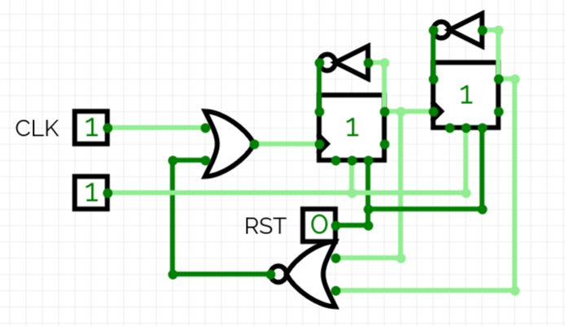

This Timer provides a countdown that when reach 0 will then stop, this is the one given in lab however I think below is an even better solution.

This is still a ripple timer however this counts up, and overall looks much neater
