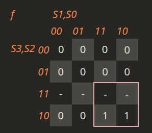

# Traffic Light Planning

First we need to write all the possible traffic light loop possible

Inner Circle means it sets T = 1 
### Traffic Light Loop
| State | Next State | $M_r$  | $S_r$  | Pedestrian_Cross? |
| ----- | ---------- | ------ | ------ | ----------------- |
| 00    | 01         | Green  | Red    | No!               |
| 01    | 10         | Yellow | Red    | No!               |
| 10    | 11         | Red    | Green  | No!               |
| 11    | 00         | Red    | Yellow | No!               |

### Traffic Light Loop with T
| State | Next State | $M_r$  | $S_r$  | Pedestrian_Cross? |
| ----- | ---------- | ------ | ------ | ----------------- |
| 0     | 1          | Green  | Red    | No!               |
| 0     | 1          | Green  | Red    | No!               |
| 1     | 2          | Yellow | Red    | No!               |
| 2     | 3          | Red    | Green  | No!               |
| 3     | 4          | Red    | Yellow | No!               |

### Traffic Light Loop
| State | Next State | $M_r$         | $S_r$         | Pedestrian_Cross? |
| ----- | ---------- | ------------- | ------------- | ----------------- |
| 0     | 1          | Green         | Red           | No!               |
| 1     | 2          | Yellow        | Red           | No!               |
| 2     | {3, 7, 9}  | Red           | Red           | No!               |
| 3     | 4          | Red           | {Red, Yellow} | No!               |
| 4     | 5          | Red           | Green         | No!               |
| 5     | 6          | Red           | Yellow        | No!               |
| 6     | {7, 9, 3}  | Red           | Red           | No!               |
| 7     | 8          | Red           | Red           | Yes!              |
| 8     | {9, 3, 7}  | Red           | Red           | No!               |
| 9     | 0          | {Red, Yellow} | Red           | No!               |

> **Note**: If _Next State_ has multiple states, It has an order and is dependant if it needs to do it.

### Traffic Light Loop (Variation 2)
| State | Next State | $M_r$         | $S_r$         | Pedestrian_Cross? |
| ----- | ---------- | ------------- | ------------- | ----------------- |
| 0     | 1          | Green         | Red           | No!               |
| 1     | 2          | Yellow        | Red           | No!               |
| 2     | {3, 6}     | Red           | Red           | No!               |
| 3     | 4          | Red           | {Red, Yellow} | No!               |
| 4     | 5          | Red           | Green         | No!               |
| 5     | 6          | Red           | Yellow        | No!               |
| 6     | {7, 8}     | Red           | Red           | No!               |
| 7     | 8          | Red           | Red           | Yes!              |
| 8     | {9, 2}     | Red           | Red           | No!               |
| 9     | 0          | {Red, Yellow} | Red           | No!               |

### Trafic Light Loop (Variation 2) 
| State | Handle_This_State? | Next State | $M_r$         | $S_r$         | Pedestrian_Cross? |
| ----- | ------------------ | ---------- | ------------- | ------------- | ----------------- |
| 0     | -                  | 1          | Green         | Red           | No!               |
| 1     | -                  | 2          | Yellow        | Red           | No!               |
| 2     | True               | 3          | Red           | Red           | No!               |
| 2     | False              | 6          | Red           | Red           | No!               |
| 3     | -                  | 4          | Red           | {Red, Yellow} | No!               |
| 4     | -                  | 5          | Red           | Green         | No!               |
| 5     | -                  | 6          | Red           | Yellow        | No!               |
| 6     | True               | 7          | Red           | Red           | No!               |
| 6     | False              | 8          | Red           | Red           | No!               |
| 7     | -                  | 8          | Red           | Red           | Yes!              |
| 8     | True               | 9          | Red           | Red           | No!               |
| 8     | False              | 2          | Red           | Red           | No!               |
| 9     |                    | 0          | {Red, Yellow} | Red           | No!               |

### Traffic Light Loop (Variation 2) Green filter (Chosen System)
| State | $M_r$                       | $S_r$                       | Pedestrian_Cross? |
| ----- | --------------------------- | --------------------------- | ----------------- |
| 0     | Green                       | Red                         | No!               |
| 1     | Yellow                      | Red                         | No!               |
| 2     | Red                         | Red                         | No!               |
| 3     | Red                         | {Red, Green_filter}         | No!               |
| 4     | Red                         | {Red, Yellow, Green_filter} | No!               |
| 5     | Red                         | Green                       | No!               |
| 6     | Red                         | Yellow                      | No!               |
| 7     | Red                         | Red                         | No!               |
| 8     | Red                         | Red                         | Yes!              |
| 9     | Red                         | Red                         | No!               |
| 10    | {Red, Green_filter}         | Red                         | No!               |
| 11    | {Red, Yellow, Green_filter} | Red                         | No!               |

| S3  | S2  | S1  | S0  | Mr_Red | Mr_Yellow | Mr_GreenF | Mr_Green | Sr_Red | Sr_Yellow | Sr_GreenF | Sr_Green | Green_Ped |
| --- | --- | --- | --- | ------ | --------- | --------- | -------- | ------ | --------- | --------- | -------- | --------- |
| 0   | 0   | 0   | 0   | 0      | 0         | 0         | 1        | 1      | 0         | 0         | 0        | 0         |

##### Global Flags (variables):
* ${Car}_M$ - If there is a car presence on $M_r$
* ${Car}_S$ - If there is a car presence on $S_r$
* $P_b$ - If there is a Pedestrian Button Pressed.

Don't Care - 12, 13, 14, 15

Mr - Red: 2, 3, 4, 5, 6, 7, 8, 9, 10, 11

f(S3, S2, S1, S0) = S1 + S2 + S3

Kmap:

Mr - Yellow: 1, 11

f(S3, S2, S1, S0) = S3'S2'S1'S0 + S3S1S0

Kmap:

Mr - GreenF: 10, 11

f(S3, S2, S1, S0) = S3S1

Kmap:

Mr - Green: 0

f(S3, S2, S1, S0) = S3'S2'S1'S0'

Kmap:

Sr - Red: 0, 1, 2, 3, 4, 7, 8, 9, 10, 11

f(S3, S2, S1, S0) = S2' + S1'S0' + S1S0

Kmap:

Sr - Yellow: 4, 6

f(S3, S2, S1, S0) = S2S0'

Kmap:

Sr - GreenF: 3, 4

f(S3, S2, S1, S0) = S3'S2'S1S0 + S2S1'S0'

Kmap:

Mr - Green: 5

f(S3, S2, S1, S0) = S2S1'S0

Kmap:

Mr - Green: 8

f(S3, S2, S1, S0) = S3S1'S0'

Kmap:

- Cs|Pb
- Cs
- Pb|Cm
- Pb
- Cm | !Cs

| State | Reset? | Time |
| ----- | ------ | ---- |
| 0     | No     | -    |
| 1     | No     | -    |
| 2     | Yes    | 3    |
| 3     | No     | -    |
| 4     | No     | -    |
| 5     | Yes    | 5    |
| 6     | No     | -    |
| 7     | Yes    | 3    |
| 8     | No     | -    |
| 9     | No     | -    |
| 10    | No     | -    |
| 11    | Yes    | 5    |

MinTerms: 2, 5, 7, 11
Don't Cares: 12, 13, 14, 15

- !Pd

|     |
| --- |
| 0   |